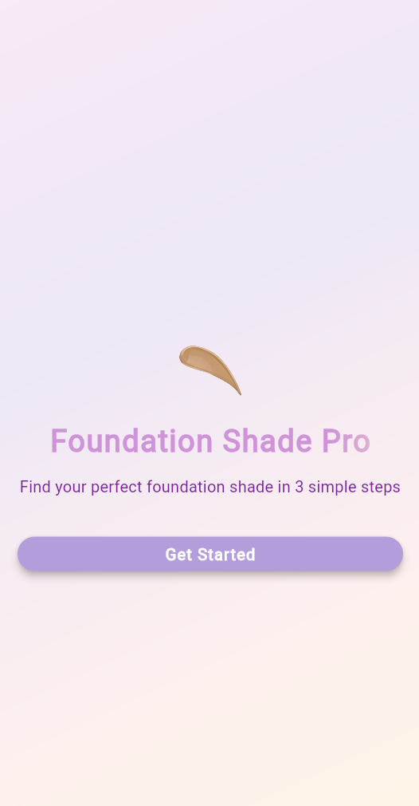
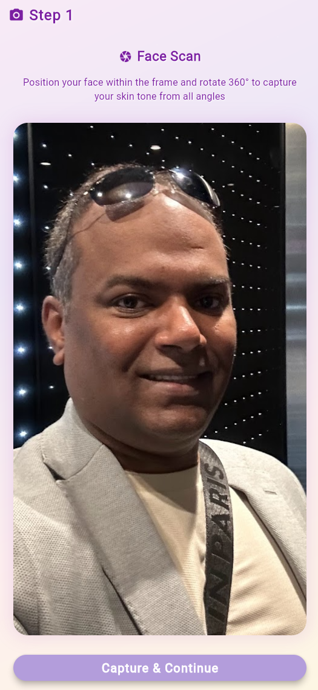
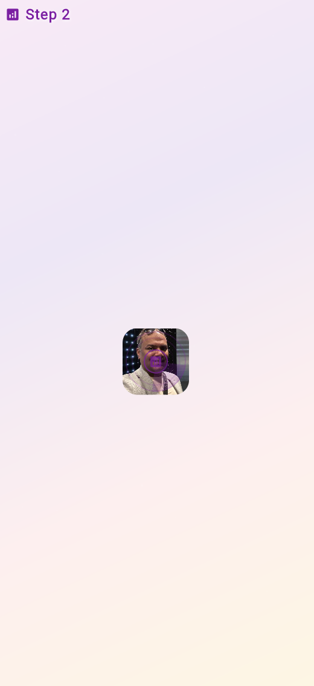
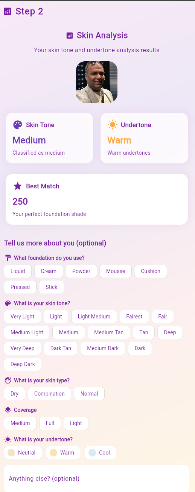
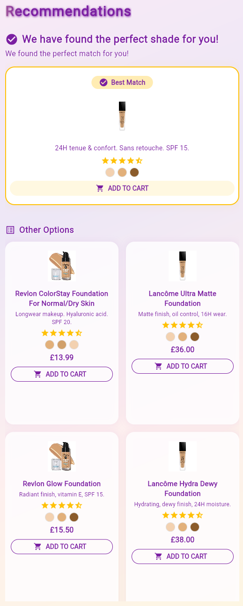

# Foundation Shade Pro

A Flutter application that helps users find their perfect foundation shade through AI-powered face scanning, analysis, and personalized recommendations.

## 🎯 Features

- **Face Scanning**: Upload or capture photos for skin tone analysis
- **AI Analysis**: Advanced skin tone and undertone detection
- **Personalized Recommendations**: Get foundation matches based on your skin profile
- **Product Catalog**: Browse and filter foundation products
- **User Preferences**: Save your preferences and skin profile

## 📱 Screen Flow

1. **User Prompts Screen**
   - Upload/capture face photo
   - Select skin tone from grid
   - Choose skin type (Dry, Combination, Normal)
   - Select preferred coverage (Light, Medium, Full)
   - Pick undertone (Neutral, Warm, Cool)

2. **Analysis Screen**
   - View skin tone analysis results
   - See undertone detection
   - Get best match shade recommendation
   - Provide additional preferences
   - Continue to recommendations

3. **Recommendations Screen**
   - View best match products
   - Browse product grid
   - Filter by brand, price, coverage
   - Save favorites
   - View detailed product information

4. **Product Details Screen**
   - View product images
   - Read detailed description
   - See shade matches
   - Check price and availability
   - Add to favorites

## 🛠️ Technical Stack

- **Framework**: Flutter
- **State Management**: Riverpod
- **Navigation**: Go Router
- **UI Components**: Custom widgets
- **Styling**: Material Design with custom theme

## 📦 Project Structure

```
lib/
├── main.dart
├── app.dart
├── screens/
│   ├── user_prompts_screen.dart
│   ├── analysis_screen.dart
│   ├── recommendations_screen.dart
│   └── product_details_screen.dart
├── widgets/
│   ├── analysis/
│   │   ├── result_card.dart
│   │   ├── prompt_section.dart
│   │   └── radar_loading.dart
│   ├── recommendations/
│   │   ├── best_match_card.dart
│   │   ├── product_grid_card.dart
│   │   ├── rating_stars.dart
│   │   ├── color_swatches.dart
│   │   └── price_display.dart
│   └── common/
│       ├── branded_app_bar_title.dart
│       ├── branded_button.dart
│       └── shimmer_title.dart
├── providers/
│   ├── dummy_data_provider.dart
│   └── theme_provider.dart
└── models/
    ├── product.dart
    └── skin_analysis.dart
```

## 🚀 Getting Started

1. **Prerequisites**
   - Flutter SDK (latest stable version)
   - Dart SDK
   - Android Studio / VS Code
   - Git

2. **Installation**
   ```bash
   git clone https://github.com/yourusername/foundation_shade_pro.git
   cd foundation_shade_pro
   flutter pub get
   ```

3. **Running the App**
   ```bash
   flutter run
   ```

## 💡 For Junior Developers

### Key Concepts to Understand

1. **Widget Organization**
   - Widgets are organized by feature (analysis, recommendations, common)
   - Each screen has its own directory of widgets
   - Common widgets are shared across screens

2. **State Management**
   - Riverpod is used for state management
   - Providers are defined in the providers directory
   - Each feature has its own provider

3. **Navigation**
   - Go Router is used for navigation
   - Routes are defined in app.dart
   - Screen transitions are handled automatically

4. **UI Components**
   - Custom widgets are used for consistent styling
   - Material Design is the base for UI components
   - Custom theme is applied throughout the app

### Best Practices

1. **Code Organization**
   - Keep widgets small and focused
   - Use meaningful names for widgets and variables
   - Follow the project structure

2. **State Management**
   - Use providers for shared state
   - Keep state as local as possible
   - Use ConsumerWidget for state changes

3. **Performance**
   - Use const constructors where possible
   - Implement proper widget keys
   - Optimize rebuilds

4. **Testing**
   - Write unit tests for providers
   - Write widget tests for UI components
   - Test navigation flows

## 📸 Screenshots








## 🤝 Contributing

1. Fork the repository
2. Create your feature branch
3. Commit your changes
4. Push to the branch
5. Create a Pull Request

## 📝 License

This project is licensed under the MIT License - see the LICENSE file for details.

## 🙏 Acknowledgments

- Flutter team for the amazing framework
- Riverpod for state management
- Go Router for navigation
- All contributors and supporters
